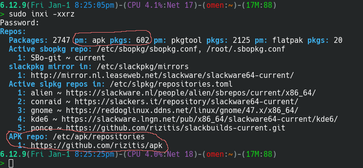

# apk
**emulation** of apk package manager **commands** on a slackware system for the specific repository **only** and for slackware**64-current**


---

## ?
Personal and *unofficial* binary repository with its own Package Manager, for Slackware64-current.<br>
It is tradition almost every *unofficial* Slackware repository to have its own package manager, so here is mine which work only with this repository **of course** :D<br>

It work like this:<br>
Every Package has
 - package_name.tar.lz4
 - package_name.sha256sum
<br>**Inside** `*.lz4` are all metadata and the binary `package_name.t?z`<br>

1. **For install-upgrade a package, apk *before* extract tar.lz4 do:** 
 - compare sha256sum and if its valid continue.<br>
 - extract tar.lz4 and search if dependencies needed...
 - install deps if command was `apk add` or skip them if was `apk fix`
 - check validate `*.t?z` md5sum and if its ok install-upgrade pkg. 

2. **When apk need to print only packages informations from repository (apk search,show,etc...):**
 - It **not** download locally packages 
 - It use curl piped to tar and read all informations on the fly from `*.lz4`. 
 
3. **When apk del need to remove a package from system:**
 - Since apk delete **only** packages that was installed from apk (dont touch slack packages or SBo or anything else)
 - Althought its has its own database for installed packages (apk stats) 
 - It also read systems packages log, so because we want to be 100% sure it will ask you 2 times to confirm before del pkg.
 
4. **I want this tool to work **only** with this repo to not have conflicts with other repos.**
 - But if a dependency is missing from here (probably for size limmit git-lfs not enough), its ok to install it from other REPO using slpkg,sbopkg,slackpkg+ etc...or you can build it from [athos](https://github.com/rizitis/PLASMA_WORLD/tree/main/AthOS) if exist there.
 
5. All packages here are builded using [athos](https://github.com/rizitis/PLASMA_WORLD/blob/main/AthOS/athos) in a Slackware64-current system always updated...

6. This repository is also compatible with [GitVoyager](https://github.com/rizitis/GitVoyager)

7. This repository is also compatible with [captain-slack](https://github.com/rizitis/captain-slack)

8. This repository is also compatible with inxi. <br>


<br>

**INFO** : I released a new [Slackware-Commander](https://github.com/rizitis/Slackware-Commander) so all helpers scripts etc... to be in one place.  

---

### !
This is not apk-tools (Alpine Package Keeper) or  Chimera`s next-generation version 3.<br>
This apk is a simple bash script which was written from scratch to work exclusively with this repository. <br>
Repo files can be found [here](./repo_contents.json)

---

#### %
- Dependencies: None in full Slackware installation. Else:`"bash curl pkgtools"`
- To install apk (meaning the package manager):
  - As regular user paste in terminal all this ugly cmd line:
    ```
    mkdir /tmp/apk && cd /tmp/apk || exit && curl -L -O https://raw.githubusercontent.com/rizitis/apk/refs/heads/main/apk && curl -L -O https://raw.githubusercontent.com/rizitis/apk/refs/heads/main/apk.env && curl -L -O https://raw.githubusercontent.com/rizitis/apk/refs/heads/main/repositories
    ```
  - Then be root (su -l) and command:
    ```
    cd /tmp/apk || exit && mkdir -p /etc/apk && cp ./apk.env ./repositories /etc/apk/ && cp ./apk /usr/local/sbin/ && chmod +x /usr/local/sbin/apk
    ```
  - Finally always as root run the update command 2 times: `apk update` to connect apk with remote repository and again `apk update` to update pakcages lists.
  - To blacklist packages for slackpkg, as root: ```echo "[0-9]+_rtz" >> /etc/slackpkg/blacklist```
- HowTo use apk, always as root command: `apk --help`
```
# === Commands for  Download,Install,Upgrade,Remove,Search <packages> === #
    #
    # apk add pkg       Add/Install a package and its dependencies if exist in apk repository
    # apk del pkg       Delete a package
    # apk search pkg    Search for packages
    # apk show pkg      Print information about a package
    # apk fix pkg       Repair package or Upgrade it without modifying dependencies
    # apk download pkg  Download package files but not install
    # apk local /path/to/pkg Install a local untrusted pkg.tar.lz4 (no check sums will be for local files)
    #    -- Example: apk local /home/my-builds/foo | That mean a foo.tar.lz4 exist there which will be installed.
    #
    # === Commands which not followed by <package> === #
    #
    # apk update        Update apk repository {local files and package list}.
    # apk upgrade       Upgrade all installed packages from the apk repository ONLY.
    # apk info          List all installed packages from the apk repository ONLY.
    # apk list          List all apk repo available packages.
    # apk stats         Show statistics ONLY about apk repository and installations.
    # apk upgrade-apk   Upgrade apk script version and apk.env.
    # apk restore-apk   downgrade apk script and apk.env to previous status before upgrade-apk.
    # apk help          Print help message
```
- To uninstall apk, as root: `rm -rf /etc/apk /usr/share/apk /usr/local/sbin/apk /var/lib/apk` 

---

#### @#$^!
Stop screaming and open an [issue:](https://github.com/rizitis/apk/issues)<br>
With God`s help maybe we can fix it...

---

#### *

> this is not SBo/ponce or conraid or alienbob repos<br>
I m just having fun here and build packages I need and **not exist** there most of times.<br>
If Slackware-stable was released every year and not when its ready, probably all these packages should be in SBo by me.<br>
But now most of them do not run or build properly in Slackware-stable so they will not be accepted in SBo<br>
Thats all, happy slacking... 

> I can not upload large files (>100MB) due to github limits.

---

### Ɔ
I prefer the `unlicence` but now I will use what Alpine Package Keeper use,<br>
so `GNU GENERAL PUBLIC LICENSE Version 2, June 1991`

---

[CURRENT.WARNING](http://ftp.slackware.com/pub/slackware/slackware64-current/CURRENT.WARNING)

```
Standard disclaimer follows... putting this back since some folks forgot ;-)

Welcome to Slackware-current!

*** upgradepkg aaa_glibc-solibs before other      ***
*** packages. Take care not to miss new packages: ***
*** upgradepkg --install-new  is (as always) the  ***
*** safest approach.                              ***

Slackware-current is a snapshot of the active Slackware development tree.
It is intended to give developers (and other Linux gurus) a chance to test
out the latest packages for Slackware. The feedback we get will allow us
to make the next stable release better than ever.

See the ChangeLog.txt for a list of changes in Slackware-current.

Please note that the code in this directory is unstable. It might be 
inconsistent about which version of the Linux kernel is required, could be
incomplete because it's in the process of being uploaded, or might not work
for other reasons. In most cases, we know about these things and are working
to correct them, but still -- feel free to point out the bugs.

Production use is AT YOUR OWN RISK and is not recommended.

Security is NOT GUARANTEED. In -current, forward progress often takes
priority. Security fixes take time and resources, and would often have to
be done more than once. It's more efficient to build the system and secure
it as time permits and/or the development cycle nears completion.

We do not promise to issue security advisories for Slackware-current.

Slackware-current might DELETE FILES WITHOUT WARNING when packages are
upgraded. (If, for example, a directory location is replaced by a symbolic
link to a new location.) Upgrade packages carefully. Examine incoming
updates first if your machine's data is not expendable. Again, we do not
recommend using Slackware-current to store or process valuable data.
It is a system in testing, not one that is ready to go (though often it does
work just fine... BUT DON'T COUNT ON IT) 

#include BSD license warranty disclaimer here...

Enjoy! :)

---
Patrick J. Volkerding
volkerdi@slackware.com
```
